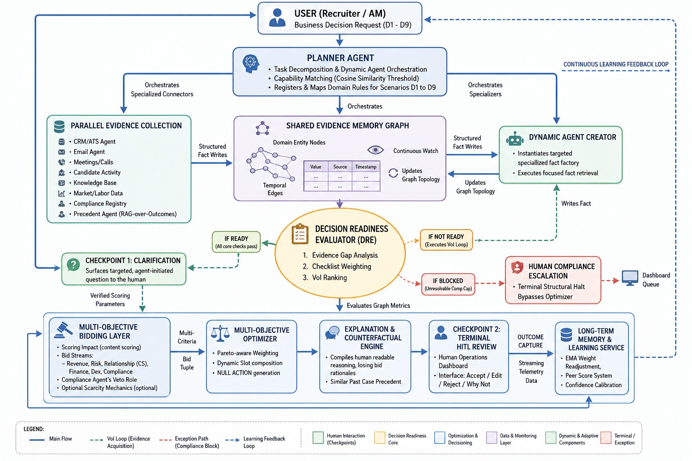

# Veridex — Intelligent Next-Best-Action Platform

## Project Overview

### What is Veridex?

**Veridex** is an enterprise-grade **Agentic Decision Intelligence Platform** designed to help staffing organizations make faster, more accurate, and fully explainable business decisions.

Modern staffing firms generate enormous amounts of operational data across Applicant Tracking Systems (ATS), Customer Relationship Management (CRM) platforms, emails, meeting notes, compliance systems, market intelligence, and historical hiring records. Although these systems capture valuable information, they operate independently, forcing recruiters and account managers to manually gather evidence before making critical decisions.

This fragmented workflow results in delayed responses, inconsistent decision-making, compliance risks, missed revenue opportunities, and excessive administrative effort.

Veridex addresses this challenge by acting as an intelligent **Next-Best-Action (NBA) co-pilot**. Instead of merely presenting analytics or dashboards, it continuously monitors operational signals, reasons over evidence using a coordinated network of AI agents, evaluates multiple business objectives simultaneously, and recommends the single most appropriate action while providing complete transparency into *why* that recommendation was made.

Unlike conventional recommendation systems that rely solely on predictive models, Veridex follows a structured **agentic decision pipeline**. Every recommendation passes through planning, evidence gathering, readiness validation, multi-objective evaluation, optimization, explanation, human approval, and continuous learning before becoming an actionable recommendation.

---

### The Business Problem

Recruiters and account managers routinely make dozens of high-impact decisions every day, including:

- Which candidate should be submitted for a new role?
- Which contractor is likely to accept a competing offer?
- Which client account requires immediate attention?
- Which contracts should be renewed, converted, or released?
- Which compliance issue could become a legal risk?
- Which idle consultants should be proactively marketed?
- When should pricing or bill rates be renegotiated?
- Which client is ready for cross-selling or expansion?

These decisions require combining information scattered across multiple disconnected systems, making the process slow, inconsistent, and difficult to audit.

Traditional staffing platforms provide data but rarely provide actionable intelligence. Recruiters are still responsible for interpreting the information, resolving conflicting evidence, assessing business trade-offs, and justifying their decisions.

Veridex transforms this workflow by converting fragmented operational data into explainable, evidence-driven recommendations that can be reviewed, approved, or modified by human decision-makers.

---

## System Architecture

<p align="center">
  
</p>

<p align="center">
  <em>Figure 1. Veridex Multi-Agent Decision Intelligence Architecture</em>
</p>

---

### How Veridex Works

For every incoming business request, Veridex executes a complete decision intelligence pipeline:

1. **Planner Agent** identifies the decision category and calculates business urgency.
2. **Evidence Agents** collect only the information required from relevant enterprise systems.
3. **Decision Readiness Evaluator (DRE)** determines whether sufficient evidence exists, working in tandem with the **Contradiction Detector** (which scans for conflicting signals and dynamically caps confidence to avoid bad decisions) and the **Missing-Info Detector** (which spots structural checklist gaps).
4. **Value of Information (VoI)** analysis identifies missing high-value information and dynamically gathers only the most impactful evidence.
5. **Specialized Business Bidders** independently evaluate the available actions from different organizational perspectives including Revenue, Risk, Operations, Finance, Customer Success, and Compliance.
6. **Optimizer** aggregates these competing objectives into the optimal recommendation while enforcing hard business constraints such as compliance vetoes.
7. **Explanation Engine** generates confidence scores, reasoning, counterfactuals, historical precedents, and alternative action analysis.
8. **Human-in-the-Loop (HITL)** allows recruiters or managers to accept, modify, reject, or challenge recommendations before execution.
9. **Learning Loop** continuously improves future recommendations using outcome feedback, bidder calibration, and adaptive weight updates.

This architecture ensures that every recommendation is transparent, auditable, and continuously improving rather than functioning as a static prediction engine.

---

### Core Capabilities

Veridex currently supports **nine recurring staffing decision archetypes**, covering the majority of operational decisions made within staffing organizations:


### 9 Decision Types Covered

| ID | Decision | Trigger |
|---|---|---|
| **D1** | Fulfillment Risk | Job order aging without quality submittals |
| **D2** | Candidate Shortlist | Multi-criteria ranking for open role |
| **D3** | Flight Risk | Competing offer or disengagement signals |
| **D4** | Contract Renewal | End-of-term action (renew / extend / convert) |
| **D5** | Bench Monetization | Idle candidate needs proactive marketing |
| **D6** | Account Health | Client reducing spend or showing churn signals |
| **D7** | Compliance Exposure | Work auth / cert expiry / background check gap |
| **D8** | Rate Negotiation | Bill-rate margin decision |
| **D9** | Cross-sell / Upsell | Client ready for expanded staffing services |

Each decision type has its own evidence requirements, optimization strategy, business objectives, learning behavior, and success metrics.

---

### Why Veridex is Different

Most Next-Best-Action platforms generate recommendations using predictive models trained on historical data. Veridex goes beyond prediction by introducing an **Agentic Decision Intelligence Architecture** that actively reasons before recommending.

Key architectural innovations include:

- **Value-of-Information-driven evidence collection** instead of gathering every available data point.
- **Dynamic agent creation** for retrieving only high-impact missing information.
- **Decision Readiness Evaluation (DRE)** to ensure recommendations are never produced with insufficient evidence.
- **Multi-objective bidding** that balances competing business priorities rather than optimizing a single metric.
- **Compliance as a deterministic hard veto**, ensuring regulatory constraints cannot be overridden by business incentives.
- **Counterfactual explanations** that show what would change the recommendation.
- **Precedent retrieval** using similar historical decisions.
- **Continuous learning** through bidder calibration, confidence evaluation, influence tracking, and outcome feedback.

These capabilities transform Veridex from a recommendation engine into a trustworthy AI decision partner capable of supporting complex enterprise operations.

---

## Quick Start

```bash
# 1. Install dependencies (5 packages only)
pip install -r requirements.txt

# 2. Set up LLM API Key (Optional)
# Create a .env file in the root directory:
# GEMINI_API_KEY=your_gemini_api_key_here
# Note: Built with graceful degradation: if no API key is present, Veridex automatically falls back to deterministic high-fidelity simulated responses, ensuring the platform never fails.

# 3. Start the platform
python -m backend.main

# 4. Open the dashboard
# http://localhost:8000
```

The server auto-seeds 225 historical outcomes across all 9 decision types on first boot. No database setup required — SQLite is created automatically.

---

### UI Views
- **Command Center** — Urgency-sorted decision queue, live agent health indicators, and core HITL statistics.
- **Run Scenario** — Interface to trigger any of the 9 pre-built decision scenarios or submit custom decision requests.
- **Mission Control** — High-level pipeline stage tracker, live SVG agent network visualizer, and SSE progress log console.
- **Investigation** — Deep-dive audit: recommendation, bidding details, evidence timeline, counterfactuals, audit trail, and database rollback metrics.
- **Human Review** — HITL checkpoint response panel (Accept/Edit/Reject, clarify questions, and on-demand "Why Not X?" queries).
- **Platform Metrics** — Live business KPIs, bidder influence budgets, Brier score calibrations, and EMA weight drift history.

---

## Architecture

```
DecisionRequest
    │
    ▼
[Planner Agent]          — Classifies decision type, computes urgency score
    │
    ▼
[Evidence Agents]        — Parallel queries across 8 sources:
                           CRM/ATS · Email Sentiment · Meeting Transcripts · Market Data ·
                           Compliance Registry · Precedent Agent · Candidate Activity · Knowledge Base
    │
    ▼
[Quality Detectors]      — Contradiction & Missing-Info Detectors:
                           Resolves data conflicts and caps confidence values before evaluation
    │
    ▼
[DRE — Dynamic Readiness Evaluator]
    │  • VoI-ranks evidence gaps (not all evidence — only what matters)
    │  • Spins up DynamicAgentCreator for critical missing facts
    │  • Output: READY / CAVEATS / BLOCKED
    ▼
[6 Parallel Bidders]     — Each independently scores the decision:
    │  Revenue · Risk · CustomerSuccess · Finance · Compliance · Ops
    │  ComplianceBidder = deterministic hard veto (no weight game)
    ▼
[Optimizer]
    │  • Weighted aggregate using influence-adjusted weights:
    │    Σ(score × effective_weight) / Σ(effective_weight)
    │    where effective_weight = base_weight × bidder_influence
    │  • score < 0.38 → NULL_ACTION with full rationale
    │  • Compliance veto short-circuits scoring entirely
    ▼
[Explanation Engine]
    │  • Rule-based counterfactuals ("what fact change would flip the decision?")
    │  • Precedent retrieval (similar past cases + outcomes)
    │  • Losing bids summary ("why not alternative X?")
    ▼
[HITL Checkpoints]
    │  • Clarification questions (pre-decision gap fill)
    │  • Human: Accept / Edit / Reject
    │  • On-demand: "Why not X?" counterfactual
    ▼
[Learning Loop]          — EMA weight updates per (bidder, decision_type)
                            Brier score calibration · Influence ledger
                            Outcome recording → improves future recommendations
```

**Persistence**: SQLite with `decision_log`, `outcomes`, `weight_snapshots`, `influence_ledger` tables.

---

## Key Technical Differentiators

### 1. VoI-Ranked Evidence Gathering
The DRE doesn't gather all evidence — it ranks gaps by **Value of Information** and only dispatches dynamic agents for high-VoI missing facts. Most NBA systems gather everything indiscriminately.

### 2. Compliance as a Hard Veto, Not a Score
The ComplianceBidder operates outside the weighted scoring game. It has architectural first-strike authority — a work auth expiry blocks the decision regardless of all other bidder scores. This is a control layer, not just a high-weight participant.

### 3. Per-Decision-Type Learning
EMA weight updates are computed per `(bidder, decision_type)` pair. The system independently learns that **Revenue** matters more for D4 (renewal) and **Risk** matters more for D3 (flight risk). Bidder weights drift separately for each context.

### 4. Explicit NULL_ACTION
When aggregate confidence falls below the threshold (`0.38`), Veridex explicitly recommends "take no action now" with a full rationale — preventing premature interventions. D5 (Bench Monetization in a saturated market) correctly triggers this.

### 5. Counterfactual + Precedent Explanations
Every recommendation includes:
- **Counterfactuals**: What single change would flip the recommendation?
- **Precedent**: What similar past decisions were made, and what happened?
- **Why Not X?**: On-demand alternative scoring against any recruiter-proposed action

### 6. Urgency-Sorted HITL Queue
The decision queue sorts by urgency score (SLA risk), not arrival time. A D1 order breaching SLA in 2 days surfaces above a D9 cross-sell, even if submitted later.

---

## API Endpoints

| Endpoint | Method | Description |
|---|---|---|
| `/api/scenarios` | `GET` | List all 9 pre-built decision scenarios |
| `/api/decisions/run-scenario` | `POST` | Run a scenario through the full pipeline |
| `/api/decisions` | `POST` | Submit a custom decision request |
| `/api/decisions` | `GET` | List all active and historical decisions (urgency-sorted) |
| `/api/decisions/{decision_id}` | `GET` | Full decision detail, recommended actions, and outcome metadata |
| `/api/decisions/{decision_id}/progress` | `GET` | Retrieve pipeline execution progress messages |
| `/api/decisions/{decision_id}/stream` | `GET` | SSE real-time pipeline progress streaming |
| `/api/trace/{decision_id}` | `GET` | Retrieve full execution trace of events |
| `/api/trace/{decision_id}/stream` | `GET` | SSE real-time execution trace streaming |
| `/api/decisions/{decision_id}/respond` | `POST` | HITL Checkpoint 2: Accept, Edit, or Reject a recommendation |
| `/api/decisions/{decision_id}/clarify` | `POST` | HITL Checkpoint 1: Answer a clarification question |
| `/api/decisions/{decision_id}/why-not` | `POST` | "Why not X?" counterfactual analysis (cached, zero LLM overhead) |
| `/api/decisions/{decision_id}/whatif` | `POST` | Run What-If simulation by patching fact values |
| `/api/outcomes/{decision_id}` | `POST` | Record downstream result (was_correct, result text) for learning loop |
| `/api/metrics` | `GET` | Combined platform metrics (influence budgets, weight history, calibration) |
| `/api/metrics/influence` | `GET` | Fetch current active influence budget weights |
| `/api/metrics/calibration` | `GET` | Fetch current bidder Brier score calibrations |
| `/api/metrics/weights` | `GET` | Fetch historical bidding weight drift snapshot history |
| `/api/evaluate` | `GET` | Calculate platform evaluation metrics and business KPIs |
| `/api/health` | `GET` | Liveness health check |
| `/api/admin/reset` | `POST` | Reset platform: clear DB tables and wipe active in-memory states |

---

## Tech Stack

| Layer | Technology |
|---|---|
| **Backend Framework** | Python 3.11 · FastAPI · Uvicorn |
| **Pipeline Engine** | Custom LangGraph-inspired state machine (`graph.py`) |
| **LLM Provider** | Google Gemini (2.0 Flash/Pro API, cost-aware dynamic routing) |
| **Database Persistence** | SQLite (persistent, zero-config, auto-created) |
| **Memory Graph** | NetworkX (representing the Shared Evidence Memory Graph) |
| **Learning & Calibration** | Custom EMA (dampened learning rate) · Brier score calibrator |
| **Frontend UI Dashboard** | Modular Vanilla HTML/CSS/JS (no build steps, clean cream/indigo dark-mode dashboard) |
| **Typography & Fonts** | Google Fonts (Inter) · JetBrains Mono |

---
## Project Walkthroughs

- **Github Link:** [Click Here](https://github.com/Pranavipulluri/Sentinel.git)
- **Architecture Walkthrough:** [Watch Here](https://drive.google.com/file/d/1Vhca9_k1AW6r3JxJh9RNBNknJE04UvD6/view?usp=sharing)
- **Demo Walkthrough:** [Watch Here](https://drive.google.com/file/d/1LrNWyUuFfnymBQd_UDezcF4Sd7mmdCvk/view?usp=sharing)
---

##  Team

| Name | Roll Number | Section |
|------|-------------|------|
| **Bopanna Visesh** | 23071A6775 | CSD-B  |
| **Pulluri Pranavi** | 23071A67B9 | CSD-B  |
| **Palagiri Haasini** | 23071A67G6 | CSD-C  |

---
